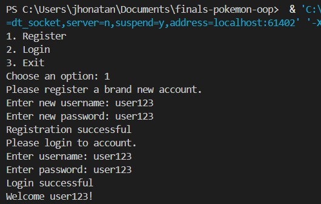
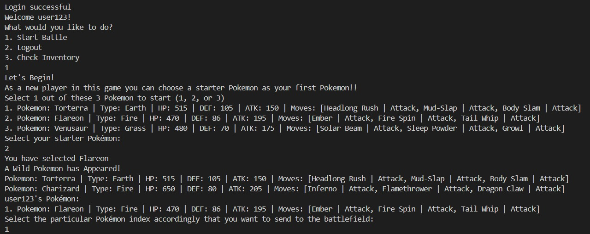
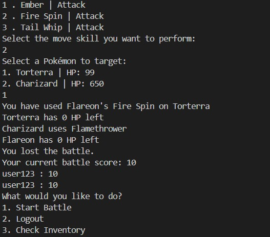
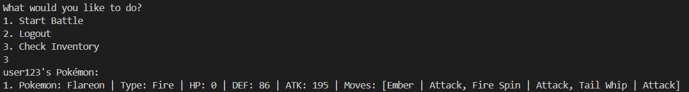

# Pokémon Battle Game (Java)

A console-based Pokémon Battle Game developed in Java using Object-Oriented Programming (OOP). Players can register an account, log in, choose a starter Pokémon, battle against wild Pokémon, manage their Pokémon inventory, and compete on a leaderboard.

---

## Features

- User registration and login
- Starter Pokémon selection
- Turn-based battle system
- Multiple Pokémon elemental types
- Pokémon move skills
- Pokémon inventory management
- Battle score leaderboard
- Pokémon catching system
- Console-based user interface

---

## Technologies Used

- Java
- Object-Oriented Programming (OOP)
- ArrayList
- HashMap
- Exception Handling
- Random Class

---

## Project Structure

```
src/
├── Main.java
├── Game.java
├── Battle.java
├── Player.java
├── Pokemon.java
├── MoveSkill.java
├── Pokeball.java
├── FirePokemon.java
├── WaterPokemon.java
├── ElectricPokemon.java
├── EarthPokemon.java
└── GrassPokemon.java
```

---

## Class Overview

| Class | Description |
|--------|-------------|
| Main | Starts the application and displays the main menu |
| Game | Handles player registration, login, and leaderboard |
| Player | Stores player information and Pokémon inventory |
| Battle | Controls the battle flow between player and opponent |
| Pokemon | Base class for all Pokémon |
| FirePokemon | Fire-type Pokémon |
| WaterPokemon | Water-type Pokémon |
| ElectricPokemon | Electric-type Pokémon |
| EarthPokemon | Earth-type Pokémon |
| GrassPokemon | Grass-type Pokémon |
| MoveSkill | Stores Pokémon move information |
| Pokeball | Represents different Poké Balls used during catching |

---

# Screenshots

## Main Menu

Players can register a new account, log into an existing account, or exit the game.



---

## Starter Pokémon Selection

New players choose one starter Pokémon before entering their first battle.



---

## Battle System

Players choose a Pokémon, select one of its available move skills, and attack an opponent in a turn-based battle.



---

## Pokémon Inventory

Players can view the Pokémon currently stored in their inventory together with their statistics and move skills.



---

## How to Run

1. Clone or download this repository.
2. Open the project using IntelliJ IDEA, Eclipse, or Visual Studio Code.
3. Ensure Java JDK 17 (or later) is installed.
4. Compile and run `Main.java`.
5. Follow the console instructions.

---

## Object-Oriented Programming Concepts

This project demonstrates several OOP concepts:

- Encapsulation
- Inheritance
- Polymorphism
- Method Overriding
- Composition
- Abstraction

---

## Future Improvements

- Save and load game progress
- Add more Pokémon species
- Introduce additional move skills
- Improve the catch probability algorithm
- Add healing items and Pokémon Center
- Develop a graphical user interface (GUI)

---

## Author

**Jhonatan Oktavianus Valeryan**

Bachelor of Computer Networking and Security

Sunway University
